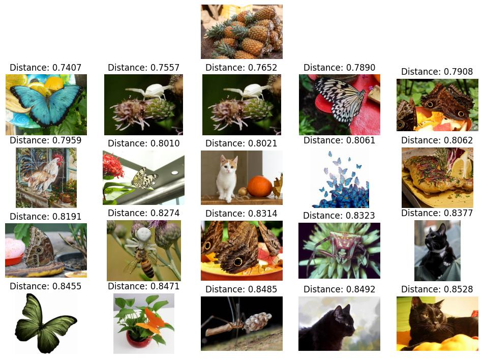
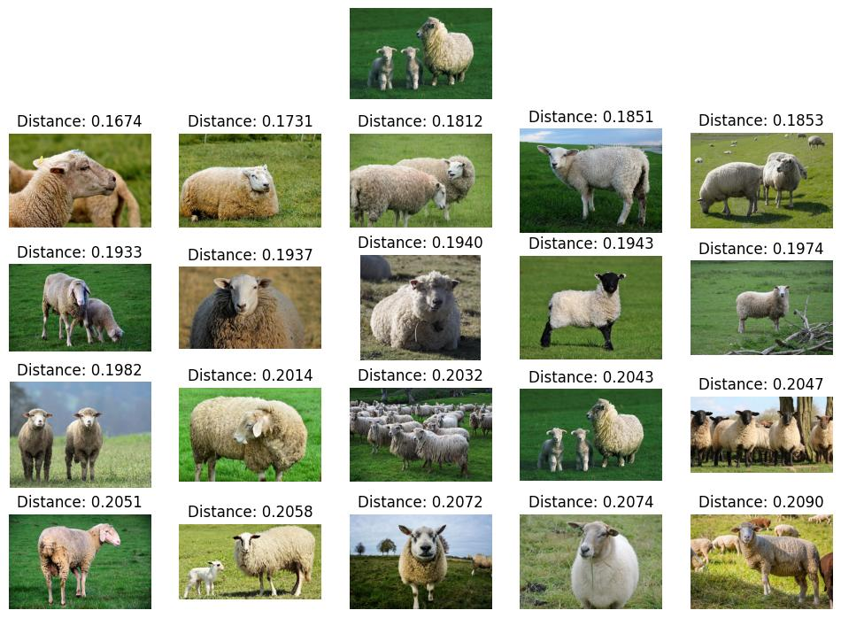

# Animal Embbedings Search using kNN

## Pipeline
Images -> Pretrained Model -> Embbedings (1000 features) -> Fit into kNN Classifier (1 image learnt -> 1 point with 1000 co-ordinates in the kNN model)

## Enviornment and Dependencies
Python 3.10.6

## Inference
To run, replace the file path of the images inside `knn.py`
```bash
python knn.py
```
Here are some example with different values of `distances` representing how close the test images is close to the findings in the dataset:

